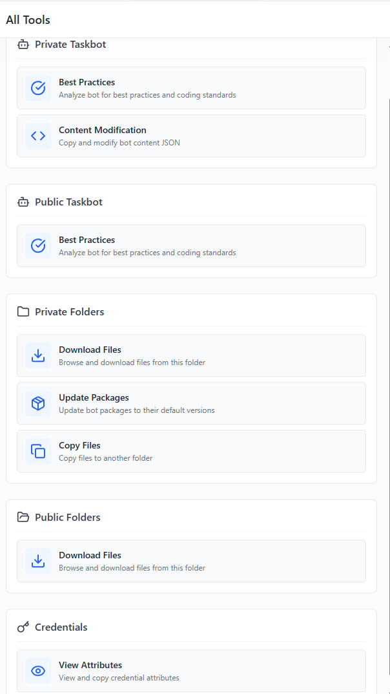

# Bot Assistant - Chrome Extension

A powerful Chrome extension for Automation Anywhere Control Room that enhances your bot development experience with modern tools and best practices analysis.

## Screenshots

### Available Tools


### Best Practices Analysis


### File Operations


### Settings & Configuration


## Features

- **Modern Side Panel Interface** - Persistent UI using Chrome's Side Panel API
- **Best Practices Analysis** - Real-time code quality checks for your bots
- **File Management** - Download, copy, and manage Control Room files efficiently
- **Package Management** - Bulk update bot packages to default versions
- **Content Modification** - Tools for managing variables and credentials
- **Universal Support** - Works with both cloud and on-premise Control Room instances

## Installation

### From Chrome Web Store
https://chrome.google.com/webstore/detail/bot-assistant/bdnogmeijaanbgpnmbhlhmkfcbaoejcp

### Manual Installation
1. Download the latest release from the [Releases](https://github.com/A360-Tools/Bot-Assistant/releases) page
2. Extract the ZIP file
3. Open Chrome and navigate to `chrome://extensions/`
4. Enable "Developer mode" (toggle in top right)
5. Click "Load unpacked" and select the extracted folder
6. The extension is now installed!

## Usage

1. Navigate to any Automation Anywhere Control Room instance
2. Click the Bot Assistant extension icon in your toolbar
3. The side panel will open with available tools
4. Select the tool you need from the navigation menu

## Supported Environments

Bot Assistant works with:
- Automation Anywhere Cloud Control Rooms (`*.automationanywhere.com`, `*.automationanywhere.digital`)
- On-premise Control Room installations (any domain)
- Local development environments

## Available Tools

### Best Practices Analysis
Automatically analyzes your bot code for:
- Error handling coverage
- Variable naming conventions
- Code organization
- Performance optimizations
- Documentation standards

### File Operations
- **Download Files** - Download files directly from Control Room folders
- **Copy Files** - Copy files between different folders
- **Update Packages** - Bulk update package versions across multiple bots

### Content Modification
- **Variable Management** - Modify and manage bot variables
- **Credential Management** - Handle credential configurations

## Development

### Prerequisites
- Node.js 18+
- npm or yarn
- Chrome 114+ (for Side Panel API support)

### Setup
```bash
# Clone the repository
git clone https://github.com/A360-Tools/Bot-Assistant.git
cd Bot-Assistant/bot-assistant

# Install dependencies
npm install

# Start development server
npm run dev

# Build for production
npm run build
```

### Project Structure
```
bot-assistant/
├── entrypoints/       # Extension entry points
│   ├── background.ts  # Service worker
│   ├── content.ts     # Content script
│   └── sidepanel/     # Vue.js application
├── public/            # Static assets
├── docs/              # Documentation
│   └── images/        # Screenshots and images
├── types/             # TypeScript definitions
└── wxt.config.ts      # WXT configuration
```

## Contributing

We welcome contributions! Please see our [Contributing Guide](CONTRIBUTING.md) for details.

## License

This project is licensed under the MIT License - see the [LICENSE](LICENSE) file for details.

## Support

- Report issues on [GitHub Issues](https://github.com/A360-Tools/Bot-Assistant/issues)
- Join our community discussions
- Check the [Wiki](https://github.com/A360-Tools/Bot-Assistant/wiki) for detailed documentation

## Acknowledgments

Built with:
- [WXT](https://wxt.dev/) - Next-gen Web Extension Framework
- [Vue.js 3](https://vuejs.org/) - Progressive JavaScript Framework
- [TypeScript](https://www.typescriptlang.org/) - JavaScript with syntax for types
- [Lucide Icons](https://lucide.dev/) - Beautiful & consistent icons
