# Bot Assistant - Chrome Extension

A powerful Chrome extension for Automation Anywhere Control Room that enhances your bot development experience with intelligent tools, best practices analysis, and streamlined workflows.


## 🚀 Features Overview

Bot Assistant transforms your Control Room experience with a suite of powerful tools designed for bot developers, administrators, and operations teams.

### 🎯 Context-Aware Tools
The extension automatically detects your current Control Room page and provides relevant tools through an intuitive side panel interface.

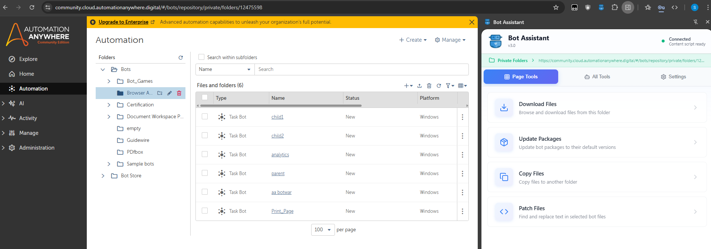

## 📸 Screenshots

### Tools Dashboard
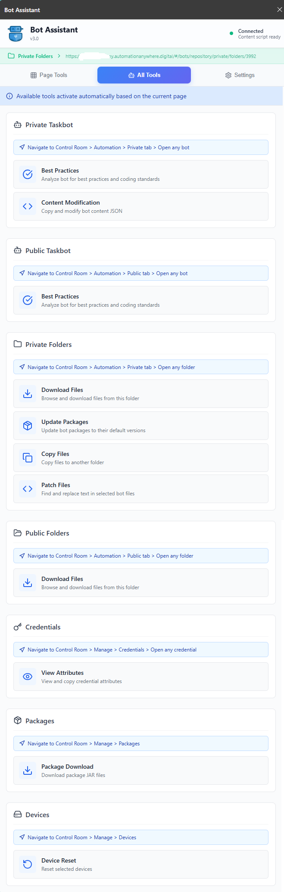

*All available tools dynamically displayed based on your current page*

### Best Practices Analysis
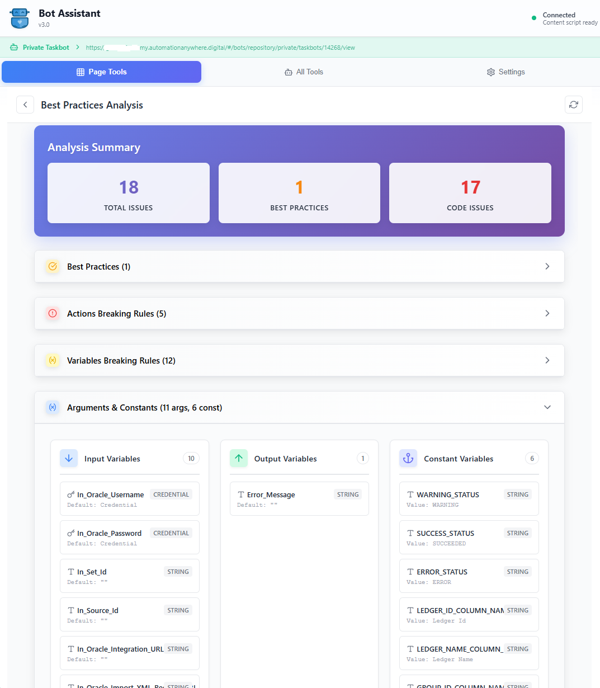

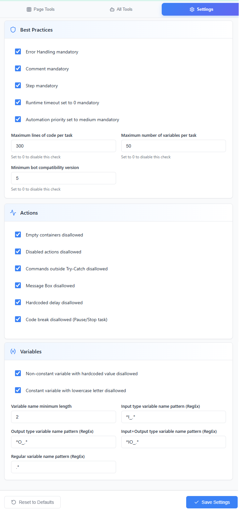

*Comprehensive code quality analysis with configurable rules*

### File Operations
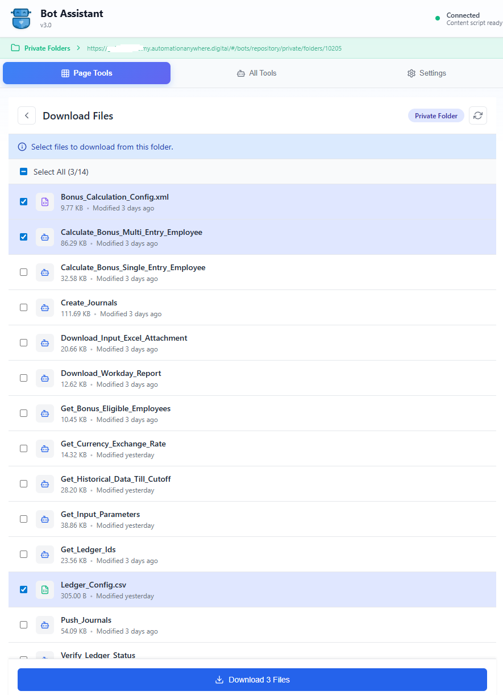

*Browse and download files with folder navigation*

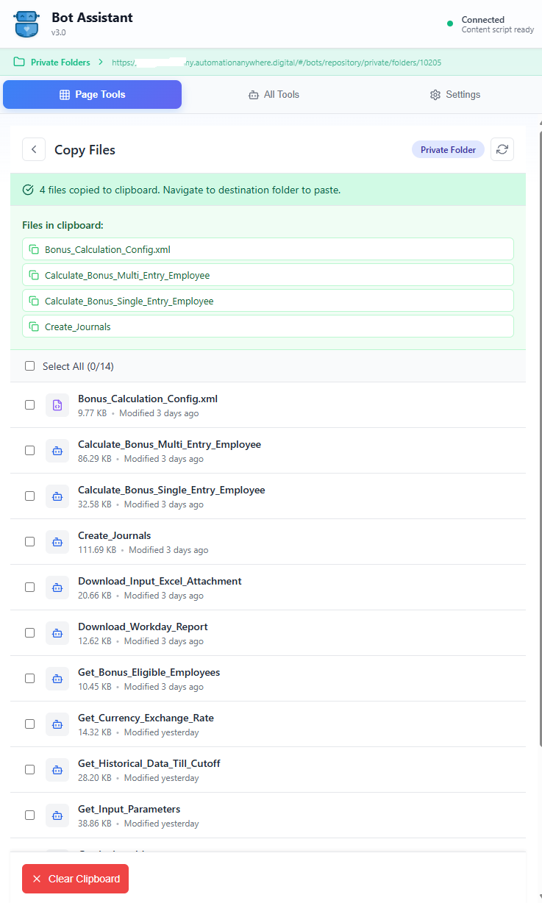

*Bulk copy files between folders*

### Package Management
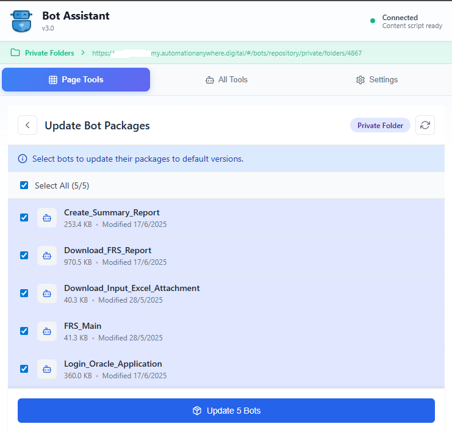

*Bulk update bot packages to default versions*

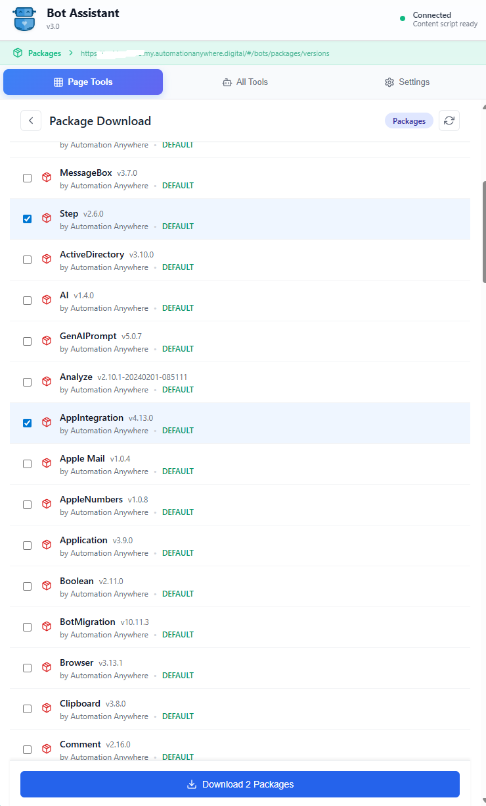

*Download package JAR files for analysis and importing into another control room*

### Content Tools
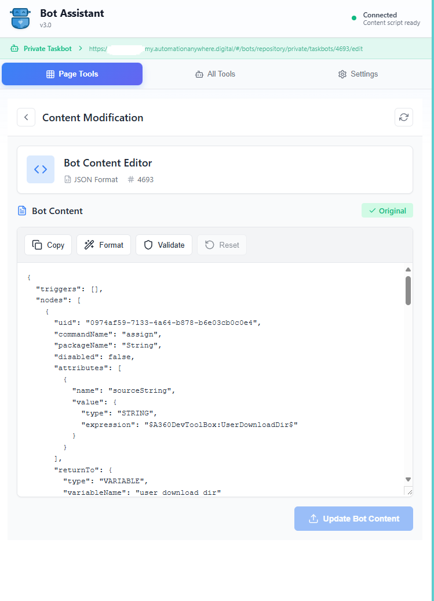

*Modify bot JSON content with syntax highlighting, can be used to copy bots from one control room to another*

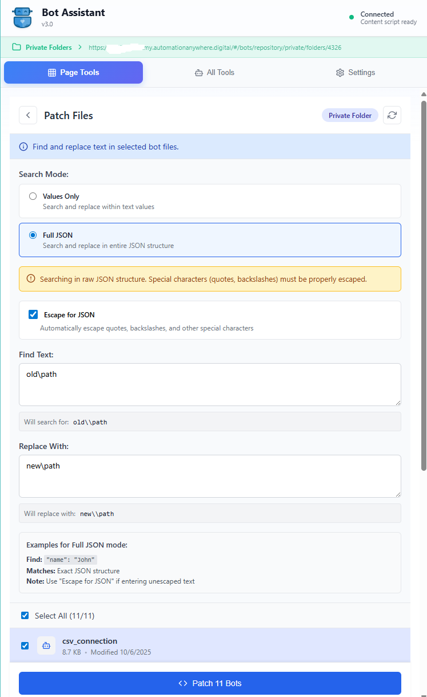

*Find and replace text across multiple bot files, useful for updating paths and other bulk changes*

### Device Management
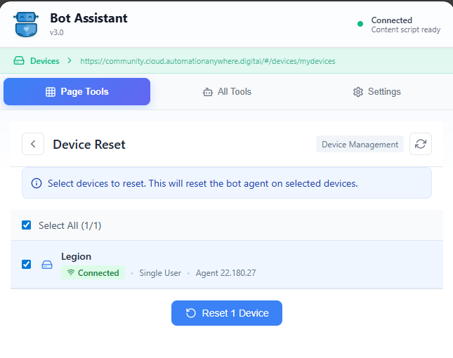

*Reset bot agents on multiple devices simultaneously*

### Credential Management
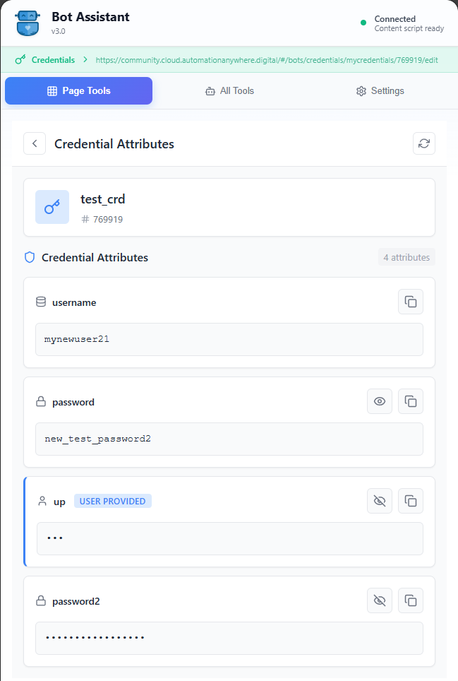

*Securely view and copy credential attributes*

## 🛠️ Available Tools

### 📋 Best Practices Analysis
Available on: **Private & Public Bot Pages**

Automatically analyzes your bot code for:
- ✅ Error handling coverage (Try-Catch blocks)
- 📝 Code documentation and comments
- 🔤 Variable naming conventions (Input/Output/Regular patterns)
- 📊 Code complexity metrics
- ⚡ Performance optimizations
- 🚫 Prohibited actions (Message boxes, hardcoded delays)
- 📦 Empty containers detection
- 🔧 Bot compatibility version checks

### 📁 File Management
Available on: **Private & Public Folder Pages**

- **Download Files** - Browse folder structure and download files with progress tracking
- **Copy Files** - Bulk copy files to different folders with conflict resolution
- **Patch Content** - Find and replace text across multiple bot files with regex support

### 📦 Package Operations
Available on: **Private Folders & Package Pages**

- **Update Packages** - Bulk update bot packages to their default versions
- **Package Download** - Download package JAR files for offline development

### 🔧 Content Modification
Available on: **Private Bot Pages**

- **Content Modification** - Direct JSON editing with syntax validation
- **Variable Management** - Add, modify, or remove bot variables

### 🖥️ Device Management
Available on: **Device Pages**

- **Device Reset** - Reset bot agents on selected devices
- **Status Monitoring** - View device connection status and agent versions

### 🔐 Credential Management
Available on: **Credential Pages**

- **View Attributes** - Securely view credential attributes
- **Copy Values** - Copy credential values to clipboard

## 🎨 Smart Features

### 🎯 Dynamic Tool System
- Tools automatically appear based on your current page
- No manual switching between contexts
- Intelligent tool recommendations

### ⚙️ Customizable Settings
- **Tool Preferences** - Set default tools for each page type
- **Analysis Rules** - Configure best practices rules
- **Variable Patterns** - Define custom naming conventions with regex

### 🔄 Bulk Operations
- Select multiple items for batch processing
- Progress tracking for long-running operations
- Detailed results reporting

### 🌐 Universal Compatibility
- Works with cloud Control Rooms (`*.automationanywhere.com`, `*.automationanywhere.digital`)
- Supports on-premise installations
- Compatible with all Control Room versions

## 📥 Installation

### From Chrome Web Store
[Install Bot Assistant](https://chrome.google.com/webstore/detail/bot-assistant/bdnogmeijaanbgpnmbhlhmkfcbaoejcp)

### Manual Installation
1. Download the latest release from [Releases](https://github.com/A360-Tools/Bot-Assistant/releases)
2. Extract the ZIP file
3. Open Chrome and navigate to `chrome://extensions/`
4. Enable "Developer mode" (toggle in top right)
5. Click "Load unpacked" and select the extracted folder
6. Pin the extension for easy access

## 🚀 Getting Started

1. **Navigate to Control Room** - Open any Automation Anywhere Control Room
2. **Open Bot Assistant** - Click the extension icon or use the keyboard shortcut
3. **Start Using Tools** - The relevant tools automatically appear based on your current page

### Quick Tips
- 📌 Pin the extension for quick access
- ⌨️ Use keyboard shortcuts for faster navigation
- 🔧 Configure default tools in Settings for automatic tool launch
- 📊 Customize best practices rules to match your team's standards

## 🔧 Configuration

### Default Tool Preferences
Configure how tools behave when you navigate to different pages:
- **Auto-select when single** - Automatically open the tool if it's the only one available
- **Always show selection** - Always display tool selection menu
- **Always use [Tool Name]** - Automatically open a specific tool

### Best Practices Rules
Customize analysis rules for your organization:
- Required code patterns
- Variable naming conventions
- Code complexity limits
- Prohibited actions

## 💻 Development

### Prerequisites
- Node.js 18+
- npm or yarn
- Chrome 114+ (for Side Panel API support)

### Setup
```bash
# Clone the repository
git clone https://github.com/A360-Tools/Bot-Assistant.git
cd Bot-Assistant/bot-assistant-extension

# Install dependencies
npm install

# Start development server with hot reload
npm run dev

# Build for production
npm run build

# Create distribution package
npm run zip
```

### Tech Stack
- **[WXT](https://wxt.dev/)** - Next-gen Web Extension Framework
- **[Vue.js 3](https://vuejs.org/)** - Reactive UI framework
- **[TypeScript](https://www.typescriptlang.org/)** - Type-safe JavaScript
- **[Lucide Icons](https://lucide.dev/)** - Beautiful icon set

### Project Structure
```
bot-assistant-extension/
├── entrypoints/          # Extension entry points
│   ├── background.ts     # Service worker for API proxying
│   ├── content.ts        # Content script for page interaction
│   └── sidepanel/        # Vue.js side panel application
│       ├── App.vue       # Main application component
│       ├── components/   # Reusable Vue components
│       ├── views/        # Tool view components
│       ├── services/     # API and business logic
│       └── utils/        # Helper functions
├── public/               # Static assets and manifest
├── docs/                 # Documentation
│   └── images/          # Screenshots and diagrams
├── types/               # TypeScript type definitions
└── wxt.config.ts        # WXT configuration
```